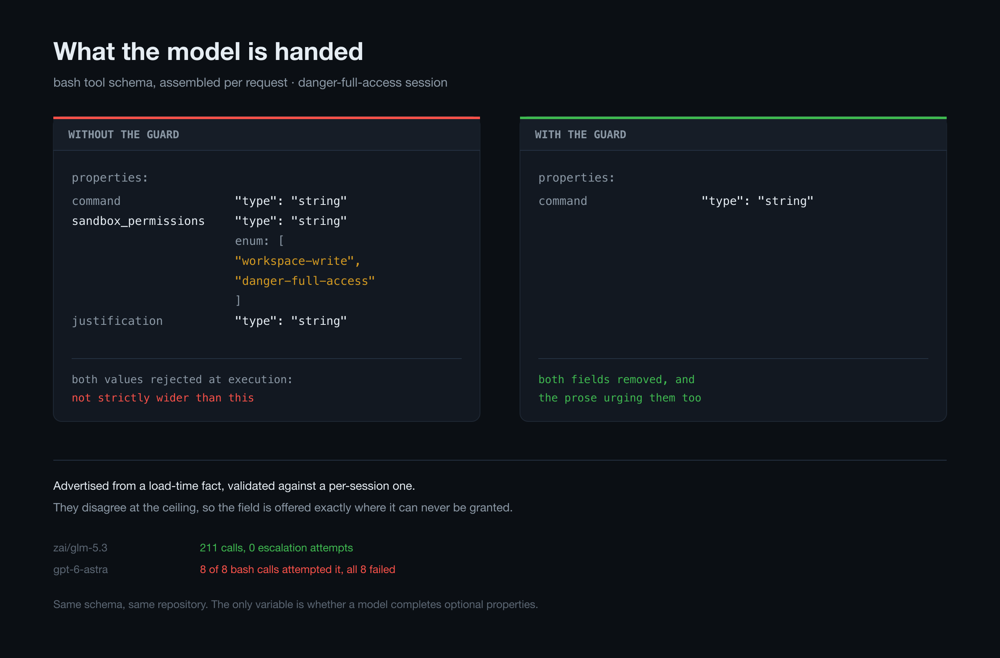
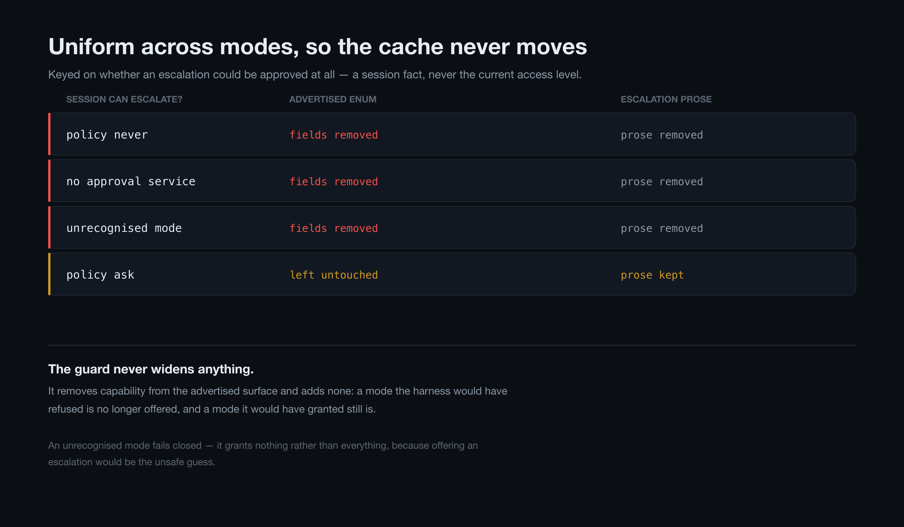
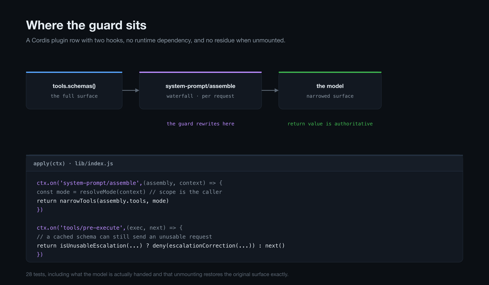
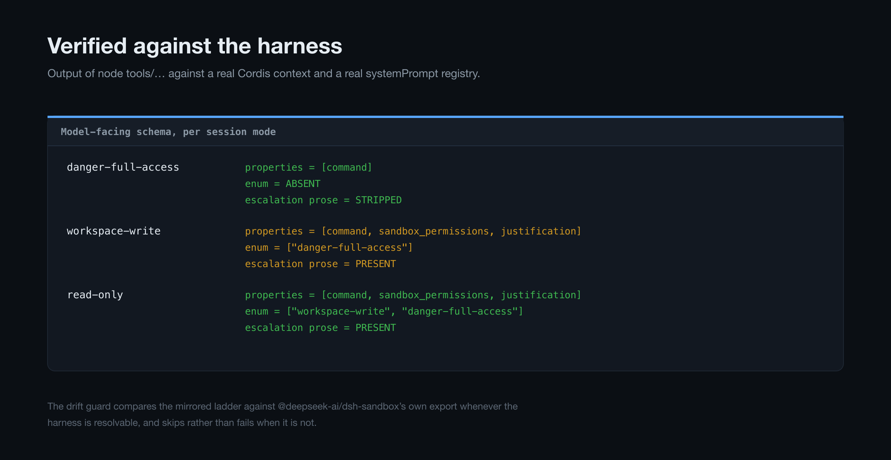

# dsh-sandbox-escalation-guard

A DeepSeek Harness plugin that stops the sandbox-escalation fields being offered
to a model when the calling session cannot grant them.

**It fixes a GPT-specific failure.** GPT-family models complete every optional
property in a tool's schema, and the two optional properties on `bash`, `write`
and `edit` are exactly the two a full-access session can never use. So GPT fills
them in on every call, every call is rejected before it runs, and the error text
never says that the fix is to omit them. The turn dies with nothing executed.

A model that sends only what a call needs never sees this — which is why it
looks like "GPT is broken" while other models are fine in the same session. The
fix is not a better prompt: it is to stop publishing fields that cannot be
filled. See [why this presents as GPT-specific](#why-this-presents-as-gpt-is-broken).

---

## The bug

The DSH escalation fields — `sandbox_permissions` and `justification` — are
advertised from a **load-time capability fact** but judged at execution against
a **per-session policy fact**:

| | Source | Question answered |
|---|---|---|
| Advertisement | `ctx.shell.sandboxMode` | *Is a confining executor mounted?* |
| Execution | `ctx.sandboxPolicy.resolve().mode` | *What mode is this session actually in?* |

They disagree in exactly the case that hurts: a session sitting at the ceiling.

A session whose effective mode is `danger-full-access` is handed:

```json
"sandbox_permissions": {
  "type": "string",
  "enum": ["workspace-write", "danger-full-access"]
}
```

Both values are unusable. `workspace-write` is a **reduction**, and
`danger-full-access` is **the mode already in force** — and the check is
*strictly* wider, so neither can ever be granted. The system prompt
simultaneously instructs the model to use that field to "escalate immediately".

A model that fills in every optional property it is shown — the GPT family does
this — then cannot succeed and cannot tell why:

```
Error: invalid justification: expected a non-empty sentence
Error: sandbox escalation to "danger-full-access" is not strictly wider than this call's current "danger-full-access" mode
Error: sandbox escalation to "workspace-write" is not strictly wider than this call's current "danger-full-access" mode
```

Neither text names the only actual repair, which is to **omit both fields**. The
observed result is the same command retried until the turn dies.

### Why this presents as "GPT is broken"

Nothing here is model-specific in the harness. The difference is a habit, and it
collides with this defect perfectly:

**GPT-family models populate every optional property in a tool's schema.** Given
`command` (required) plus `sandbox_permissions` and `justification` (optional),
they do not send the minimum the call needs — they send a fully-formed instance
of the schema they were shown. Asked for one string, they fill in three.

That habit is usually harmless. Here it is fatal, because the two optional
properties are the exact two that a full-access session can never use. So the
model helpfully completes them on **every** call, each call is rejected before
anything runs, and the error text points at the justification field rather than
at the real instruction, which is to leave the fields out. Retrying with the
same habit produces the same rejection. The turn ends with no command executed
and no usable signal about why.

A model that only sends what the call needs never touches those fields and never
sees the bug. From the outside, that looks like one model being broken — same
session, same harness, same repository, different models, only one of them
failing.

The fix follows directly from the diagnosis: **if the model completes whatever
it is shown, stop showing it things it cannot use.** Once both fields are gone
from the schema, there is nothing left for the habit to complete, and the
failure mode disappears for the model that was most prone to it — without the
model needing to know it existed, and without a prompt telling it to be careful,
which is the kind of instruction a schema-completing model is least likely to
reliably follow.

This is why the primary fix is suppression rather than a clearer error message.
A better message asks the model to behave differently; removing the field does
not depend on the model's cooperation at all. The `tools/pre-execute`
correction exists only for the residual case — a cached schema, or a model that
ignores the schema it was given.

### Evidence

From one live session (effective mode `danger-full-access`, approval policy
`never`), comparing a model that completes optional properties against one that
does not:

| model | tool calls | emitted `sandbox_permissions` | bash calls | bash + optional field |
|---|---|---|---|---|
| `zai/glm-5.3` | 211 | **0** | 86 | 48 |
| `oauth-codex/gpt-6-astra` | 10 | **8** | 8 | **8** |

The GLM column is not "a model that tried and succeeded" — it emitted the field
**zero** times in 211 calls. It never entered the failure mode, because it sends
only the properties a call needs. The GPT column emitted it on **every** bash
call and lost all eight to the same rejection.

Same session, same schema, same repository, same effective mode. The only
variable is whether the model completes the optional properties it was shown —
which is why this reads from the outside as "GPT is broken" rather than as a
schema defect that one model's habits expose.

Confirmed at the wire level too: the `request/header` event for that session
shows `bash`, `write` and `edit` each advertising `sandbox_permissions` with
`enum: ["workspace-write","danger-full-access"]`, so the field was genuinely
published to the model rather than being something it invented.

---

## What this plugin does

### 1. It stops publishing the impossible (the actual fix)

The tool set is still mutable at `system-prompt/assemble`, which is a
**sanctioned extension point** and runs per request. The rewrite is decided by a
**session fact** — whether an escalation could be approved at all — never by the
current access level:

- when the session's approval policy is `never`, and for any unrecognised mode,
  **remove both fields entirely** and strip the escalation paragraph from the
  tool description that would otherwise keep urging the model to use them;
- when an escalation genuinely could be approved, **leave the surface exactly as
  the harness built it**.

An earlier revision instead kept only the enum values strictly wider than the
*current* mode. That is gone, for two independent reasons:

- **It moved the cached prefix.** The tools block is the front of the cache, so
  rewriting it on an access-level change discarded the entire cached
  conversation behind it.
- **The value it kept was going to be rejected anyway.** Keeping
  `["danger-full-access"]` for a `workspace-write` session publishes a value that
  becomes the rejected one the moment the session is switched to
  `danger-full-access`. Since a field can always safely be *omitted*, and a
  published-but-rejected value is what actually breaks a model, the safe set is
  the intersection across every mode a session can reach — which is empty as soon
  as that range includes `danger-full-access`.

Because the deciding fact is the approval policy rather than the mode, the
published surface is byte-identical on every request and across every
access-level switch. That is the property that protects the cache, and
`test/mount.test.mjs` pins it directly.

It still judges grantability by the same strictly-wider ladder
`@deepseek-ai/dsh-sandbox` exports and `approveEscalation` enforces, so the two
cannot disagree about what is grantable. That ladder is mirrored in
`lib/wider-modes.js` rather than imported, which is why this package has **no
runtime dependency** — it plugs into the host contract alone (`apply` +
`inject`). A `test/wider-modes.test.mjs` drift guard compares the mirror against
the harness's own export and fails if DSH ever changes the ladder.

For a session under a `never` policy the model now receives a bash tool with only
`command` and `description`, and no escalation prose at all — in every mode.

### 2. It corrects a call that carries them anyway

A client holding a cached schema, or a model that ignores its schema, can still
send an unusable request. `tools/pre-execute` then denies it with text that
names the effective mode, states that no value is grantable, and names the
repair — instead of the two opaque validations.

This is a fallback where (1) applies, and the *only* mechanism where it does not.
In a session under an `ask` policy the surface is deliberately left intact, so
this listener is what keeps an unusable call from failing opaquely.

### The plugin never widens anything

It only stops offering modes that cannot be granted. It never grants a mode the
harness would have refused, and it cannot: it removes capability from the
advertised surface and adds none.

---

## Suppression matrix

The headline guard is **uniform across modes** — that is what keeps the cached
tools prefix byte-stable for the length of a session.

| session can have escalation approved? | advertised enum | description prose |
|---|---|---|
| no — approval policy `never`, no approval service, or unrecognised mode | *(fields removed)* | escalation paragraph removed |
| yes — an approval channel exists and policy is not `never` | *(left exactly as the harness built it)* | kept |

The two conditions are **session facts**, not properties of the current access
level. `ApprovalService.decide` returns `"rejected"` outright when the effective
policy is `never`, before any approver is consulted, so under that policy an
escalation is impossible in *every* mode — and the right published surface is
also the same in every mode.

An unrecognised mode grants nothing rather than everything: `SandboxMode` is a
validated closed union, so this cannot arise from a healthy host, and offering an
escalation would be the unsafe guess.

### The residual, and the per-call correction

When escalation genuinely *can* be approved, the guard does not edit the surface
at all. A call that still carries an unusable request is then corrected at
`tools/pre-execute`, which re-evaluates per call and costs nothing to re-run.
This covers:

- a session under `ask` whose current mode happens to leave nothing wider — for
  example `danger-full-access`, from which no escalation is ever grantable;
- a client holding a cached schema;
- a model that ignores its schema entirely.

The correction names the effective mode, states that no value is grantable, and
names the repair — unlike the two opaque validations it replaces. See
[What this plugin does and does not cover](#what-this-plugin-does-and-does-not-cover)
for why the enum is not trimmed per mode.

## Install

```bash
dsh plugin --profile web add github:iimaguest/dsh-sandbox-escalation-guard
```

That installs from GitHub, writes the dependency, and adds the profile's
`bundles` entry, so the `cordis.patch.yml` in this package mounts
automatically. Confirm the row:

```bash
grep -A 14 '"bundles"' ~/.dsh/profiles/web/package.json
```

**Activation is a profile load, not a file write.** The plugin takes effect when
the profile is next loaded.

### Managing the install

```bash
# pull new commits that have landed on GitHub
dsh plugin --profile web update dsh-sandbox-escalation-guard

# remove completely
dsh plugin --profile web remove dsh-sandbox-escalation-guard
```

To disable it without uninstalling, remove `dsh-sandbox-escalation-guard` from
the profile's `bundles` list. To develop against a local checkout instead of
GitHub, `dsh plugin --profile web add /path/to/dsh-sandbox-escalation-guard`.

## Configuration

```yaml
- id: dsh-sandbox-escalation-guard
  name: dsh-sandbox-escalation-guard
  config:
    warn: true             # log each intervention to the host console
    resolveMode: ...       # testing seam only; omit in production
    escalationPossible: ... # testing seam only; omit in production
```

| field | default | meaning |
|---|---|---|
| `warn` | `true` | Log when the schema is narrowed or a call is corrected. |
| `resolveMode` | *(unset)* | Overrides effective-mode resolution for the per-call correction. Testing seam; production reads the session's own `sandbox/mode` fold through `sandboxPolicy`. |
| `escalationPossible` | *(unset)* | Overrides whether the published surface keeps the escalation fields. Testing seam; production reads the approval policy. |

## What this plugin does and does not cover

This is stated plainly because the coverage changed during development, and the
honest version is narrower than an earlier claim in this file.

**It covers the case where escalation can never be approved.** When the
deployment's approval service exists and the session's policy is `never`,
`ApprovalService.decide` returns `"rejected"` before any approver is consulted,
so an escalation is impossible **in every mode**. The guard then removes the
escalation fields from the published surface, uniformly, in every mode. This is
the reported configuration (the failing session logged
`approval/policy: {policy: never}`), and it is fixed.

**It also corrects, per call, any unusable request that arrives anyway** — a
cached schema, a model ignoring its schema, or a session whose policy is `ask`.
That check runs at `tools/pre-execute`, costs nothing to re-evaluate, and names
the exact repair.

**It does NOT narrow the advertised enum to the values grantable from the
current mode.** An earlier revision did, and that was wrong twice over:

1. **It broke the cache.** The enum moved whenever the access level changed, and
   the tools block is the front of the cached prefix, so a mode switch discarded
   the entire cached conversation behind it.
2. **It published a value that was going to be rejected anyway.** A
   `workspace-write` session advertised `["danger-full-access"]`. Omitting a
   field is always safe; publishing a value that is later rejected is what breaks
   a model. The set that is safe in *every* mode a session can be switched into
   is the intersection across those modes — and it is **empty** as soon as the
   range includes `danger-full-access`:

   | mode | grantable from it |
   |---|---|
   | `read-only` | `workspace-write`, `danger-full-access` |
   | `workspace-write` | `danger-full-access` |
   | `danger-full-access` | *(none)* |

   No value is grantable from all three, so a surface that never offers a
   rejected value cannot offer any value.

**The consequence, stated without hedging:** in a session whose approval policy
is `ask`, the guard leaves the tool surface exactly as the harness built it. It
suppresses nothing there, and a GPT-family model at `danger-full-access` under
`ask` can still fill the fields and get one rejected call — corrected by the
pre-execute listener rather than prevented. That residual is the deliberate
price of never invalidating a prefix. It is also the exact case where the
harness's own validation is reachable, so the failure is a correction with a
named repair rather than the opaque loop that motivated this plugin.

A deployment that genuinely cannot change a session's access level can opt into
the tighter surface with `escalationPossible: false`, which suppresses
uniformly. That is a statement about the deployment, made by the deployment —
not a guess this plugin makes from a mode it cannot know is stable.

## Screenshots









These are diagrams of the harness's own contracts rather than captures of a UI,
and every value in them is copied from verified output — generating them is
`npm run screenshots`, and the mode table in the last image is exactly what
`npm run verify` prints.

## Reproducing the claim

```bash
npm install
npm run verify
```

Mounts the plugin against a real Cordis context and a real `systemPrompt`
registry and prints the model-facing bash schema for each session mode — the
plugin's observable claim, reproducible rather than described.

## Tests

```bash
npm test
```

48 tests:

- **`test/guard.test.mjs`** — the suppression matrix, the strictly-wider table
  against `approveEscalation`'s judgement, and prose stripping.
- **`test/wider-modes.test.mjs`** — drift guard: the mirrored ladder is compared
  against `@deepseek-ai/dsh-sandbox`'s own export whenever the harness is
  resolvable, and skipped (not failed) when it is not.
- **`test/mount.test.mjs`** — the plugin applied to a real Cordis context and a
  real `systemPrompt` registry, asserting what the model would be handed, that a
  session which *can* escalate keeps the harness's own bytes untouched, that the
  published surface does **not** move when the access level changes, that
  unmounting restores the original surface exactly (so this is an ordinary plugin
  row with no residue), and that the pre-execute correction fires only on
  unusable requests. Some of these mount the plugin **before** the policy service
  exists and then provide it, which is the real boot order — see the note below.
  Others mount neighbouring listeners on both sides of the guard, and
  re-assemble fifty times per mode to prove the output bytes never move.
- **`test/real-services.test.mjs`** — the same contract mounted against the
  harness's **real** `ApprovalService` and `SandboxPolicy`, not the testing seam.
  This is the file that proves the gate reads the harness's own approval fact:
  a fake `{ effectivePolicy: () => 'never' }` agrees with any implementation,
  including a wrong one. Skipped (not failed) when the harness is unresolvable.

### The waterfall must be chained

`ctx.waterfall` dispatches through a chained thunk — `(cbs.shift() ?? inner)` —
so a listener that returns **without calling `next()` ends the chain** for every
listener registered after it. The first version of this plugin did exactly that,
which silently suppressed the `system-prompt/assemble` listeners of
`dsh-session-reference` and `dsh-agent` for the whole process. Their
contributions never reached a request and nothing reported the loss; it was
found by probing the dispatcher against two listeners, not by any single-listener
test. The listener now `await`s `next()` and narrows the result, which is also
the correct order — the model must receive the *final* assembly.

### The service-ordering trap

`ctx.get('sandboxPolicy')` must not be read once inside `apply` and closed over.
A bundle patch is appended to the composition, while `sandbox-policy` sits
earlier in the base tree and is provided asynchronously, so the row can load
before the service exists. Closing over the result binds `undefined` and the
plugin then narrows nothing for the entire session — silently, having printed a
warning that looks like a missing dependency rather than a race.

Declaring `sandboxPolicy` in `inject` is the other wrong answer: it defers
`apply` until the service appears, so on a composition that genuinely lacks it
the plugin waits out the session with no hooks registered and no diagnostic at
all. The guard resolves the service per request instead, mounts unconditionally,
and reports a genuinely absent service once, at the first request it cannot
serve. `mount.test.mjs` pins both halves: untouched before the service arrives,
narrowing immediately after.

The escalation-prose fixtures in `guard.test.mjs` are copied verbatim from the
shipped `dsh-tool-bash` and `dsh-tool-fs` descriptions. If a DSH upgrade reworks
that wording, the prose tests fail loudly rather than this package silently
ceasing to strip prose.

---

## Known limits

**It cannot repair the schema's origin.** This plugin rewrites the schema on its
way to the model; it does not change `dsh-tool-bash` or `dsh-tool-fs`. The
underlying predicate — advertising from `ctx.shell.sandboxMode` while validating
against `ctx.sandboxPolicy.resolve()` — remains the harness's own, and the
correct upstream fix is to gate the fields on the session's resolved mode (and
to accept the current mode as a no-op). This plugin is the durable workaround
for an install that must not patch `node_modules`.

**Prose stripping is anchored, not structural.** The escalation paragraph is
removed by matching its leading clause. If a future DSH rewrites that text the
schema fix still applies and only the prose is left behind — the model keeps its
instructions but loses the fields they refer to. The pinned tests make that
visible.

**The pre-execute fallback denies rather than executes.** Letting the call
proceed by stripping the arguments would require re-implementing tool
dispatching, because `exec.arguments` is deep-frozen before any plugin
observes it. A denial that names the repair is the safe choice; with (1) active
it should never fire.

**A listener registered after this one can still re-add the fields.** The
guard narrows the assembly returned by `next()`, which carries the work of every
listener *upstream* of it in the chain. A plugin that appends tool schemas and
happens to register after this one would put un-narrowable fields back.
Middleware order is absolute and cannot be corrected from inside the waterfall.
This does not arise with the shipped set: `dsh-session-reference` and
`dsh-agent` both call `next()` and only read `assembly.variables`, adding no
tools.

## On prompt caching

The guard rewrites request content, which is the exact shape of change that can
quietly destroy a provider's prefix cache. So this is measured against what the
providers actually document, not assumed.

### What the providers say

| Provider | Rule |
|---|---|
| [OpenAI](https://developers.openai.com/api/docs/guides/prompt-caching) | Changing `tools` changes "names, descriptions, schemas, **ordering**, or tool-specific instructions". Cache reuse "requires the entire rendered prefix to match". The cache-routing hash is taken over the initial tokens "**including tool definitions when present**". |
| [Anthropic](https://platform.claude.com/docs/en/agents-and-tools/tool-use/tool-use-with-prompt-caching) | The hierarchy is `tools → system → messages`; "Modifying tool definitions" invalidates the **entire** cache at every level. |
| [DeepSeek](https://api-docs.deepseek.com/guides/kv_cache/) | Caching is automatic and disk-based; a request hits only by **fully matching** a persisted cache prefix unit. |

All three agree on the operative point: tool definitions sit at the front of the
prefix, so they must be byte-stable for reuse to happen at all.

### Why this plugin satisfies it

**The bytes are constant for the length of a session.** The effective mode is a
session fact, so `narrowTools` yields identical output on every assembly. The
schema is narrowed *once*, in effect, and every later turn sends the same bytes.
The cache is written on the first request and read thereafter — unaffected in
steady state.

**Nothing varying is introduced.** No timestamp, counter, identifier, token or
regeneration enters the output, so the routing hash is stable too.

**Neither name nor order changes.** Only `properties` entries and the
description text are filtered; the tool list keeps its order and every tool keeps
its name. Property insertion order is preserved from the input, so a rewrite
never reorders keys and changes bytes without changing meaning.

**The result never depends on request history.** Rendering a given mode produces
the same bytes whether it is the first request or the hundredth.

**It makes the cached prefix smaller, not different.** The escalation fields are
removed rather than rewritten, so the published definition is a strict subset of
the original.

### What is pinned by tests

`test/mount.test.mjs` asserts the contract directly:

- 50 consecutive assemblies per mode produce exactly **one** distinct
  `JSON.stringify` of the tool surface;
- the same mode renders identically no matter where it falls in a sequence of
  differing modes;
- tool names and list order survive narrowing;
- property key order survives narrowing.

### Mid-session access changes: the honest cost

An earlier version of this section claimed the harness already invalidates the
prefix on a mode change, via the `sandbox:policy` prompt context. **That was
wrong**, and the correction matters because it changes who pays.

**The policy text is an appended message, not part of the prefix.**
`dsh-sandbox-policy` registers a `sandbox:policy` context whose text is a
function of the resolved mode, but `dsh-agent-loop` renders the whole context
snapshot and appends it to the message list:

```js
const context = this.runtimeContext.project(joinContextSections(sections), sections)
// ...
{ kind: "enter", messages: context === void 0 ? claimed : [...claimed, context] }
```

The snapshot even announces itself: *"This snapshot supersedes earlier
runtime-context snapshots."* Content appended at the end of a conversation
cannot invalidate anything cached ahead of it, so **a mode change costs nothing
by itself.**

**`tools` is the channel that carries the cost.** `assembly.tools` feeds both
`buildRequest` and `toolsChanged()`, which drives the request-series restart;
`headerEquals` compares schemas by canonical JSON. The guard's rewrite is a
tools rewrite, so it *is* the thing that moves the cached prefix.

**And the tools block genuinely would not move without this plugin.** The
advertised escalation enum derives from a *mount-time* capture — `dsh-tool-bash`
reads `const defaultMode = ctx.shell.sandboxMode` once in `apply`, and
`ESCALATION_TARGETS` follows from it — while `resolveSandboxPolicy` resolves per
call. That load-time/execution-time split is the root bug this plugin exists to
fix, and a side effect of it is that the published schema is *static across a
mode change*. So nothing in the harness would invalidate the prefix, and the
guard's rewrite is the sole cause.

**So the guard does introduce a cache write on a mode change** — one that would
not otherwise occur. Being precise about the size of that:

| | cost of one mid-session mode change |
|---|---|
| Harness alone | nothing — the snapshot is appended, the tools block is static |
| With this guard | one cache write, then reads resume normally |

**It is still the right trade, for a stated reason.** Without the rewrite the
model keeps a schema offering escalation fields that no longer work — which is
exactly the failure this plugin exists to prevent, reinstated mid-session. A
single cache write per mode change buys a surface that always matches the
session's real permissions. Mode changes are user actions, not per-turn events,
so the frequency is low by construction.

**It cannot be avoided from inside this design.** There is no way to correct a
published schema without changing it, and the fields live in the tools block.
The alternative is recovery rather than prevention — correcting the call after
it is rejected instead of never advertising it — which costs no cache write but
costs one failed tool call per affected turn. The related
`apex-mochen/dsh-sandbox-arg-guard` takes that route. The two are complementary,
and this is the specific axis on which they differ.

**Steady state is unaffected**, which is the property that matters day to day:
with the mode unchanged, the tool bytes are identical on every request, so
`toolsChanged()` is false, no series restarts, and there is no repeated cost.
`test/mount.test.mjs` pins all three facts.

## License

Apache-2.0
